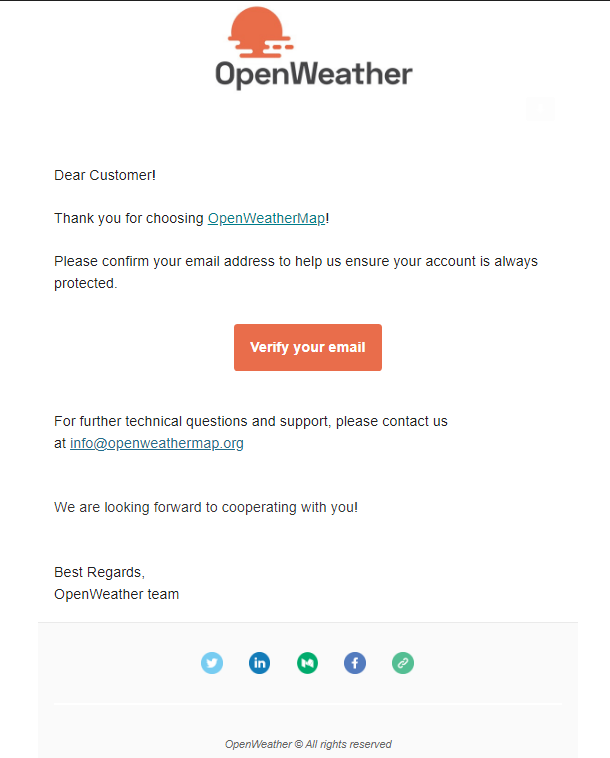
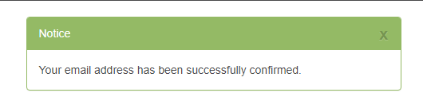

# Proyecto Clima5 - API de Clima Open Weather Map

---

## Sitio WEB:

## https://corbaz.github.io/api-clima/

## Sitio Web de consulta API:

## https://openweathermap.org/api

---

## Vite.js + React + Tailwind CSS v3

---

```
-------------
Instalar VITE
-------------

Con NPM :
_________

npm create vite@latest


Con Yarn:
_________

yarn create vite


__________________________________
Instalar dependencias mode_modules
__________________________________

Con NPM:    npm i


Con Yarn:   yarn


---------------------
Instalar TAILWIND 3.0
---------------------

Con NPM:

npm install -D tailwindcss@latest postcss@latest autoprefixer@latest


Con Yarn:

yarn add -D tailwindcss@latest postcss@latest autoprefixer@latest


-------------------------------------------------------------------
Creación de archivos de configuración de Tailwind CSS y de PostCSS
-------------------------------------------------------------------
'tailwind.config.js' - 'postcss.config.js'
-------------------------------------------------------------------

npx tailwindcss init -p


en el archivo generado 'tailwind.config.js' modificamos el content:

module.exports = {
 content: ["./index.html", "./src/**/*.{js,jsx,ts,tsx}"],
 theme: {
    extend: {},
  },
  plugins: [],
};


agregaremos las directivas en el index.css

/* src/index.css */
@tailwind base;
@tailwind components;
@tailwind utilities;


para el mensaje de Warning: "Unknown at rule @tailwind",

1. Simplemente vaya a la configuración de usuario (ctrl +,) para acceso directo.
2. Busque CSS en la barra de búsqueda.
3. Busque el (CSS> Lint:Unknown At Rules)
4. Seleccione "Ignorar" de las opciones desplegables.

```

---

### Documentación Oficial de Vite: https://vitejs.dev/

### Documentación Oficial de React: https://es.reactjs.org/

### Documentación Oficial de TailwindCSS: https://tailwindcss.com

---

```
----------------------------------------------------------
Inicialización de Git y Creación del repositorio en Github
----------------------------------------------------------

git init

Repositorio:
https://github.com/corbaz/api-clima.git


git add .
git commit -m "Instalación"
git branch -M main
git remote add origin https://github.com/corbaz/api-clima.git
git push -u origin main

```

---

```
Para consultar la api

debí crear una cuenta en:

* https://home.openweathermap.org/users/sign_up

* cree un usuario: corbaz
     con password: **********

Recibi un mail con un link para la verificación de mi direccióon de email.
```

## Verificación





---

## API

### https://home.openweathermap.org/api_keys

- KEY:  
  41c24d525dac0eed946d6145c5e582c5

- NAME:  
  clima5

---

## Para hacer Deploy del Sitio Web:

```
1. retirar la carperta /dist del archivo .gitignore

2. ejecutar del package.json el script:

"build": "vite build",

3. git add .

4. git commit -m "Deploy Clima 5 version 1.0"

5. git subtree push --prefix dist origin gh-pages
```

---

## Sitio WEB:

## https://corbaz.github.io/api-clima/
